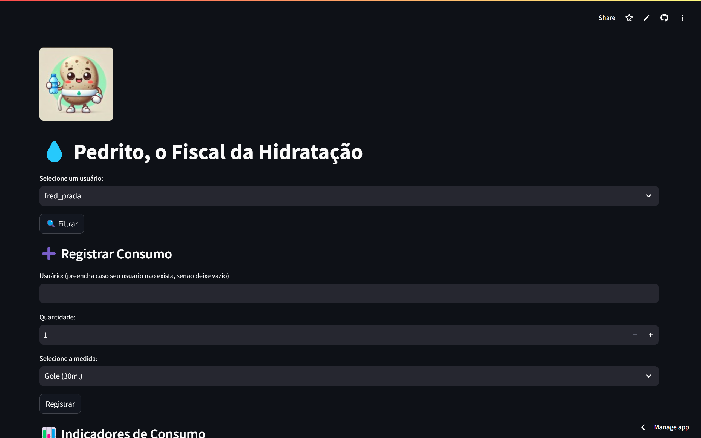
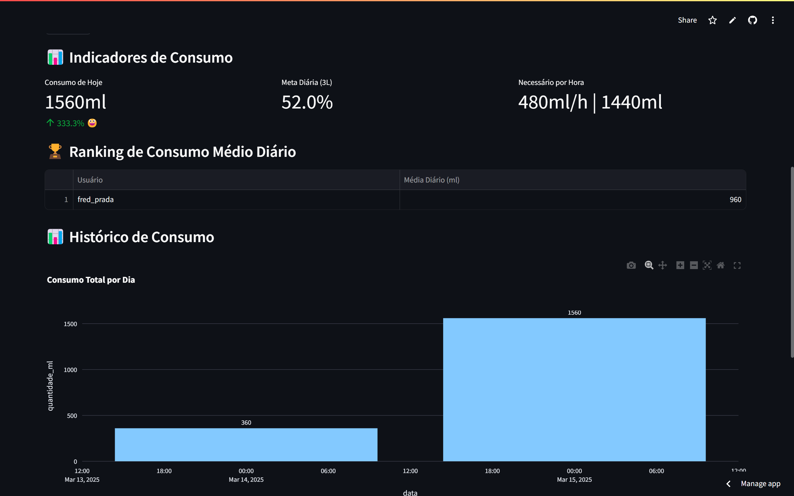
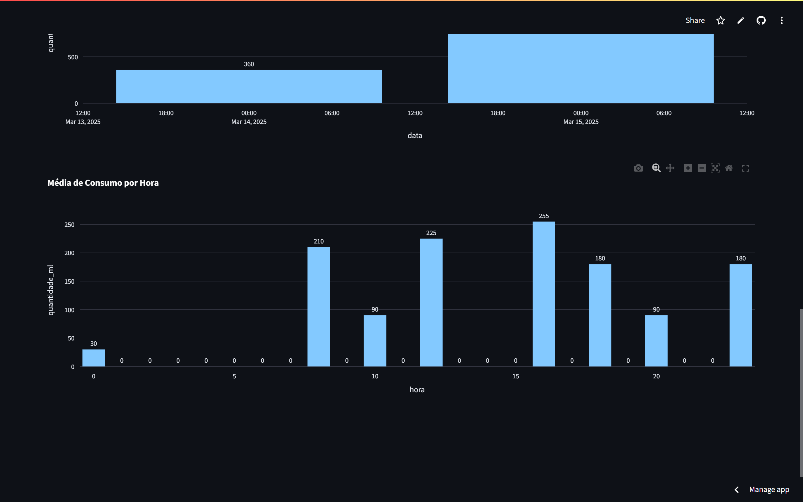

# Consumo Pessoal de Água

## Descrição do Projeto
Este projeto tem como objetivo monitorar e visualizar o consumo pessoal de água, ajudando os usuários a manterem uma hidratação adequada para melhorar a saúde. A aplicação utiliza Python, Streamlit e Plotly para criar gráficos interativos, e os dados são armazenados no Supabase.

## Funcionalidades
- Registro do consumo diário de água
- Visualizações interativas com Plotly
- Aplicação em Streamlit para exibição de gráficos e acompanhamento do consumo

## Tecnologias Utilizadas
- Python
- Pandas, NumPy
- Plotly (gráficos interativos)
- Supabase (banco de dados)
- Streamlit (interface interativa)

## Exemplo da Interface  




## Como Executar
1. Clone o repositório:
   ```sh
   git clone https://github.com/fredprada/consumo_agua.git
   ```
2. Navegue até o diretório do projeto:
   ```sh
   cd consumo_agua
   ```
3. Crie um ambiente virtual (opcional, mas recomendado):
   ```sh
   python -m venv venv
   source venv/bin/activate  # No Windows: venv\Scripts\activate
   ```
4. Instale as dependências:
   ```sh
   pip install -r requirements.txt
   ```
5. Para rodar a aplicação Streamlit localmente:
   ```sh
   streamlit run app.py
   ```

## Estrutura do Projeto
```
consumo_agua/
│-- app.py            # Código principal para execução no Streamlit
│-- assets/           # Recursos como imagens ou arquivos auxiliares
│-- README.md         # Documentação do projeto
│-- requirements.txt  # Dependências
```

## Contato
Se tiver dúvidas ou sugestões, entre em contato através do GitHub ou envie um e-mail para fredprada@example.com.

